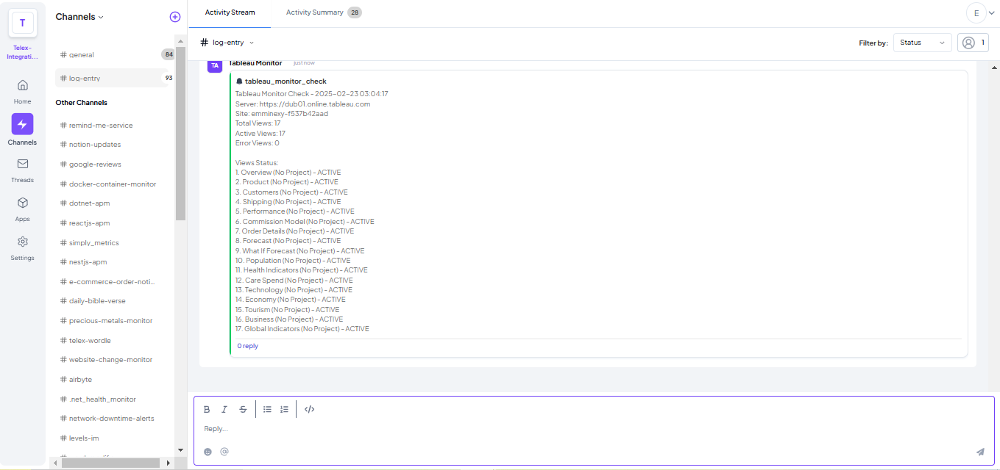

# Tableau Dashboard Monitor for Telex

A Telex integration that monitors Tableau dashboards for performance issues and failures. The integration checks dashboard load times and availability at specified intervals and reports issues to your Telex channel.


## Features

-  Real-time dashboard load time monitoring
-  Automatic failure detection
-  Performance threshold alerts
-  Error log analysis
-  Configurable check intervals using cron syntax
-  Automatic status reporting to Telex

## Screenshots



Example alerts in Telex channel:
```
Tableau Monitor Check - 2025-02-23 02:44:40
Server: https://dub01.online.tableau.com
Site: emminexy-f537b42aad
Total Views: 17
Active Views: 15
Error Views: 2

Views Status:
1. Sales Dashboard (Main Project) - ACTIVE
2. Performance Overview (Analytics) - ACTIVE
3. Error Report (Finance) - ERROR
```

## Setup

### Prerequisites

- Python 3.9+
- Tableau Server access
- Tableau API token
- Telex webhook URL

### Environment Variables

```bash
TABLEAU_SERVER_HOST=your-tableau-server
TABLEAU_SITE_NAME=your-site-name
TABLEAU_TOKEN_NAME=your-token-name
TABLEAU_API_TOKEN=your-api-token
```

### Installation

1. Clone the repository:
```bash
git clone https://github.com/telexintegrations/hng12-stage3-tableau-dashboard-monitor/
cd hng12-stage3-tableau-dashboard-monitor
```

2. Install dependencies:
```bash
pip install -r requirements.txt
```

3. Run locally:
```bash
python -m flask run
```

### Deployment on Render

1. Create a new Web Service on Render
2. Connect your GitHub repository
3. Configure environment variables
4. Use these settings:
   - Build Command: `pip install -r requirements.txt`
   - Start Command: `gunicorn "api.monitor:app"`

## API Endpoints

### Integration Configuration
```http
GET /api/integration
```
Returns the Telex integration configuration.

### Monitor Status
```http
GET /api/monitor
```
Manually triggers a dashboard check.

```http
POST /api/monitor
```
Receives tick requests from Telex for scheduled checks.

## Telex Integration

1. Add the integration URL to your Telex organization:
```
https://hng12-stage3-tableau-dashboard-monitor.onrender.com/api/integration
```

2. Configure settings:
   - `interval`: Cron expression for check frequency (to set 10 mins: `*/10 * * * *`)
   - `Load Time Threshold`: Maximum acceptable load time in seconds (default: `10`)

### Using cURL

1. **Test Health Check Endpoint**
```bash
curl https://hng12-stage3-tableau-dashboard-monitor.onrender.com/
```
Expected response:
```json
{
    "status": "ok",
    "message": "Tableau Monitor API is running",
    "timestamp": "2025-02-23 16:03:48",
    "user": "cod-emminex",
    "uptime": "Active",
    "endpoints": [
        "/api/integration",
        "/api/monitor"
    ]
}
```

2. **Get Integration Configuration**
```bash
curl https://hng12-stage3-tableau-dashboard-monitor.onrender.com/api/integration
```
Expected response:
```json
{
    "data": {
        "date": {
            "created_at": "2025-02-23",
            "updated_at": "2025-02-23"
        },
        "descriptions": {
            "app_name": "Tableau Monitor",
            "app_description": "Detects failures or slow loading of Tableau reports...",
            "app_logo": "https://img.icons8.com/color/48/tableau-software.png",
            "app_url": "https://hng12-stage3-tableau-dashboard-monitor.onrender.com",
            "background_color": "#fff"
        },
        "integration_type": "interval",
        "integration_category": "Monitoring & Logging",
        "settings": [
            {
                "label": "interval",
                "type": "text",
                "required": true,
                "default": "*/40 * * * *"
            },
            {
                "label": "Load Time Threshold",
                "type": "number",
                "required": true,
                "default": "10"
            }
        ]
    }
}
```

3. **Test Monitor Endpoint (GET)**
```bash
curl https://hng12-stage3-tableau-dashboard-monitor.onrender.com/api/monitor
```

4. **Test Monitor Endpoint (POST with custom return URL)**
```bash
curl -X POST \
  https://hng12-stage3-tableau-dashboard-monitor.onrender.com/api/monitor \
  -H "Content-Type: application/json" \
  -d '{
    "return_url": "https://ping.telex.im/v1/webhooks/your-webhook-id",
    "settings": [
        {
            "label": "interval",
            "type": "text",
            "required": true,
            "default": "*/40 * * * *"
        }
    ]
}'
```

### Using Web Browser

1. **View Health Status**
   - Open: https://hng12-stage3-tableau-dashboard-monitor.onrender.com/
   - You should see a JSON response with the current status

2. **View Integration Configuration**
   - Open: https://hng12-stage3-tableau-dashboard-monitor.onrender.com/api/integration
   - This shows the configuration that Telex uses

3. **Trigger Manual Monitor Check**
   - Open: https://hng12-stage3-tableau-dashboard-monitor.onrender.com/api/monitor
   - This will trigger a manual check of all Tableau dashboards

### Using Telex Interface

1. Go to your Telex organization's Apps page
2. Click "Add Integration"
3. Enter the integration URL:
   ```
   https://hng12-stage3-tableau-dashboard-monitor.onrender.com/api/integration
   ```
4. Configure settings:
   - Set interval (e.g., "*/5 * * * *" for every 5 minutes)
   - Set Load Time Threshold (e.g., 10 seconds)
5. Go to your Telex channel 
6. You should see the Tableau Monitor integration with the configured settings
7. Toggle the integration to start monitoring
8. You will receive alerts in the channel based on the configured settings

### Verifying Integration

After setting up, you should see messages in your Telex channel like:
```
Tableau Monitor Check - 2025-02-23 16:03:48
Server: https://dub01.online.tableau.com
Site: emminexy-f537b42aad
Total Views: 17
Active Views: 15
Error Views: 2

Views Status:
1. Sales Dashboard (Main Project) - ACTIVE
2. Performance Overview (Analytics) - ACTIVE
3. Error Report (Finance) - ERROR
```

### Troubleshooting Tests

If you encounter issues:

1. **Check Server Status**
```bash
curl -I https://hng12-stage3-tableau-dashboard-monitor.onrender.com/
```
Expected: HTTP/1.1 200 OK

2. **Verify Tableau Credentials**
```bash
curl https://hng12-stage3-tableau-dashboard-monitor.onrender.com/api/monitor
```
Check for authentication errors in response, and if you are faced with such, ensure your Tableau credentials are correct.

3. **Test CORS Headers**
```bash
curl -X OPTIONS \
  -H "Origin: https://your-domain.com" \
  -H "Access-Control-Request-Method: POST" \
  https://hng12-stage3-tableau-dashboard-monitor.onrender.com/api/monitor
```

4. **Monitor Logs**
If using Render, check the logs in the dashboard for detailed error messages.


## Development

Current development status:
- Version: 1.0.0
- Last Updated: 2025-02-23 02:44:40
- Developer: cod-emminex

## Contributing

1. Fork the repository
2. Create your feature branch (`git checkout -b feature/amazing-feature`)
3. Commit your changes (`git commit -m 'Add some amazing feature'`)
4. Push to the branch (`git push origin feature/amazing-feature`)
5. Open a Pull Request

## License

This project is licensed under the MIT License - see the [LICENSE](LICENSE) file for details.

## Support

For support:
1. Open an issue
2. Contact via Telex: emminexy@yahoo.com
3. GitHub: [https://github.com/cod-emminex]

## Acknowledgments

- Tableau Server Client library
- Telex platform
- Icons by Icons8
